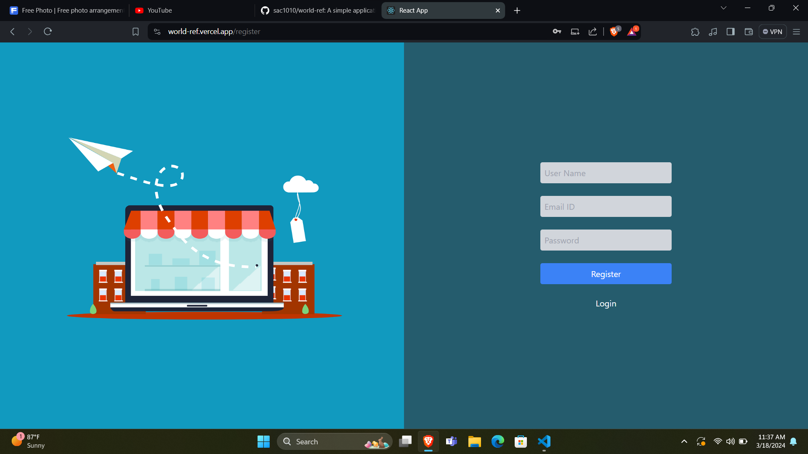
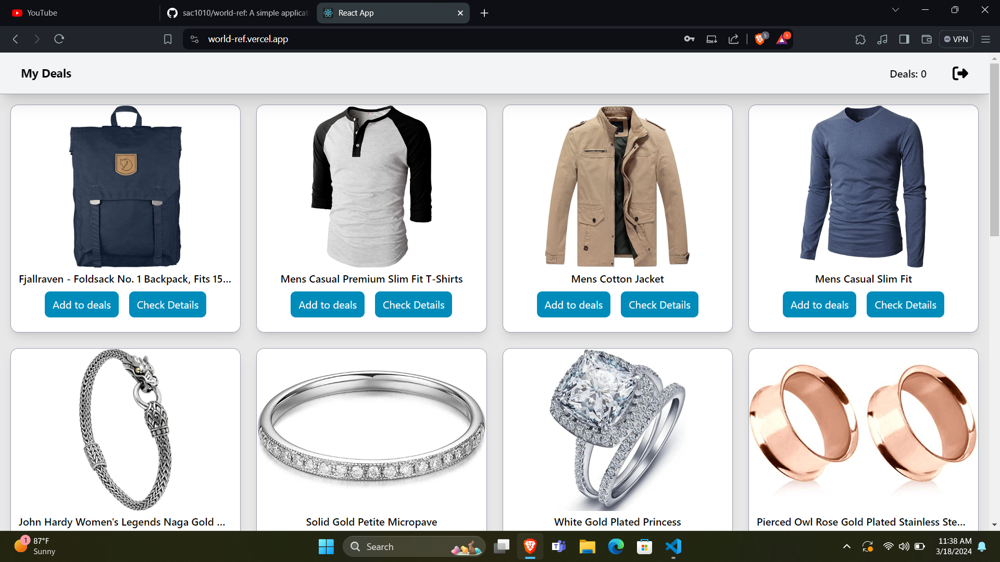
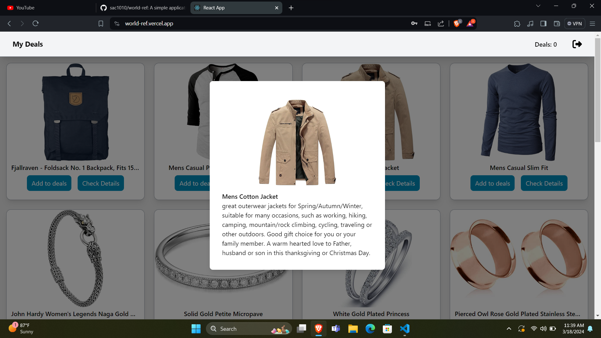

# Media Gallery

## Description

A web application with a Login/ register feature and a homepage which displays the cards. Built using react js, tailwind css and firebase

## Screenshots

# Getting Started with Create React App

This project was bootstrapped with [Create React App](https://github.com/facebook/create-react-app).

## Available Scripts

In the project directory, you can run:

### `npm start`

Runs the app in the development mode.\
Open [http://localhost:3000](http://localhost:3000) to view it in your browser.

The page will reload when you make changes.\

## Contributing

Contributions are welcome! If you'd like to contribute to this project, please follow these steps:

1. Fork the repository.
2. Create a new branch for your feature or bug fix.
3. Make your changes.
4. Test your changes thoroughly.
5. Submit a pull request describing your changes.
